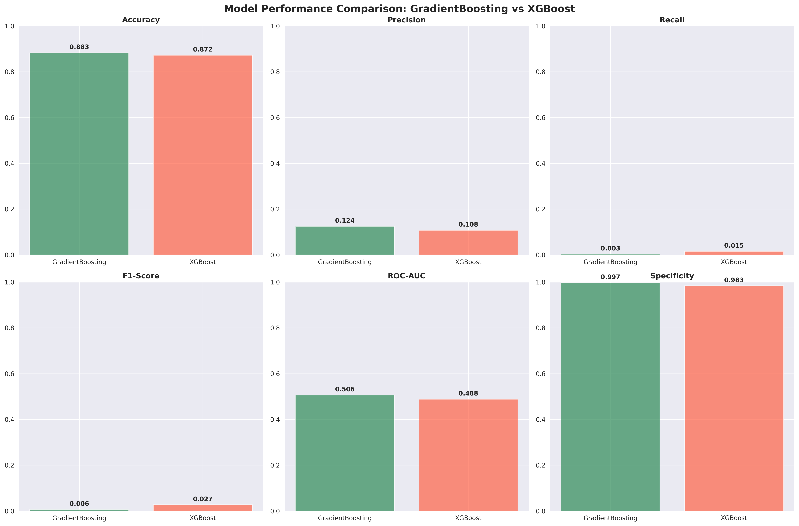
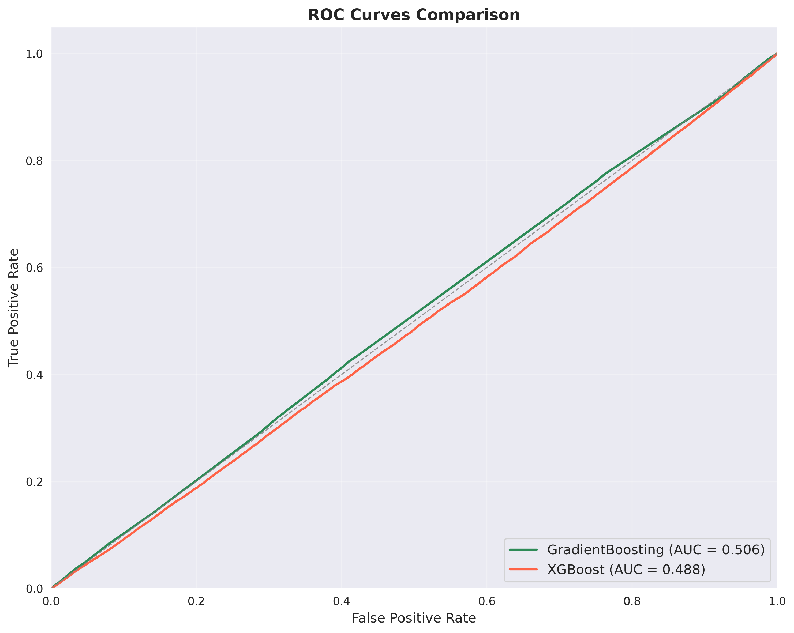
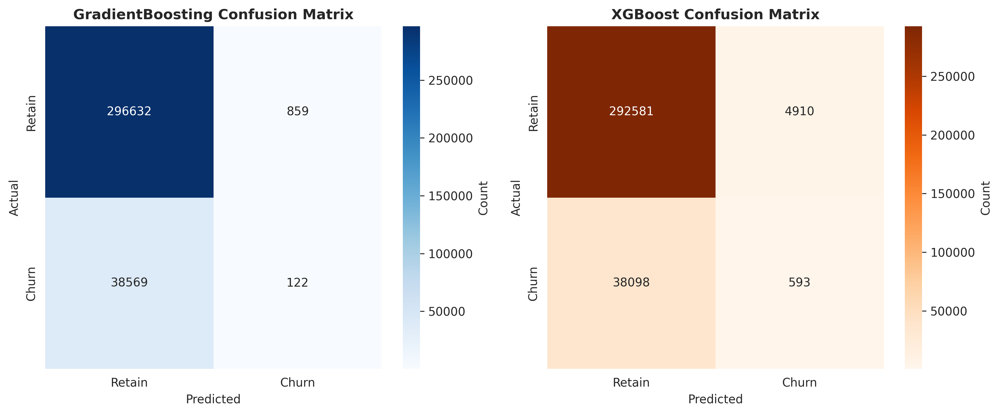
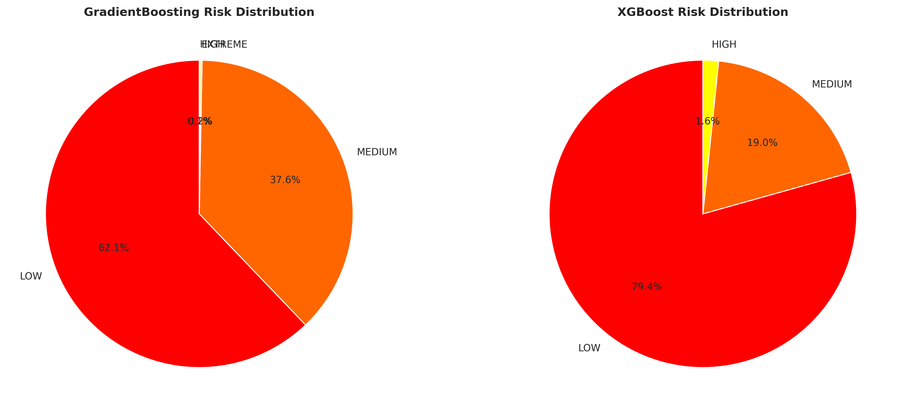
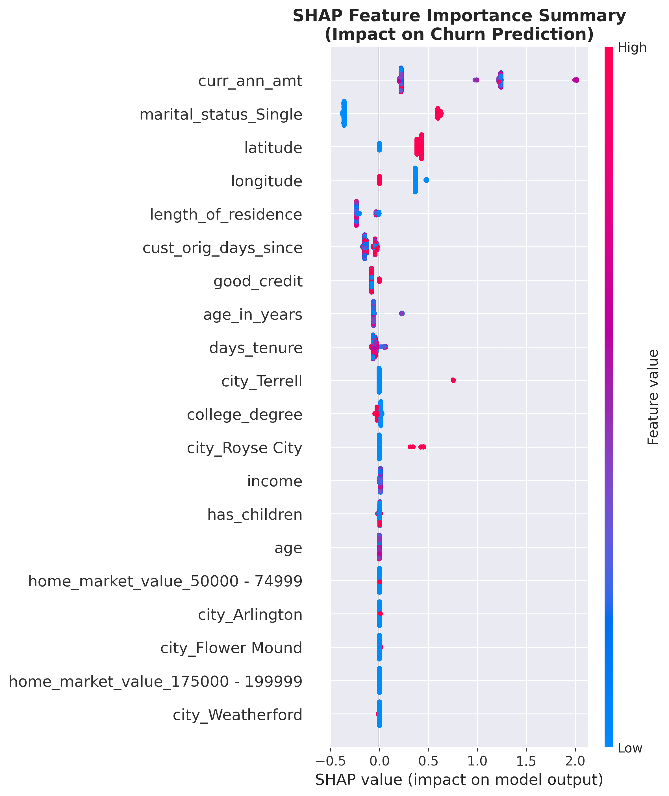
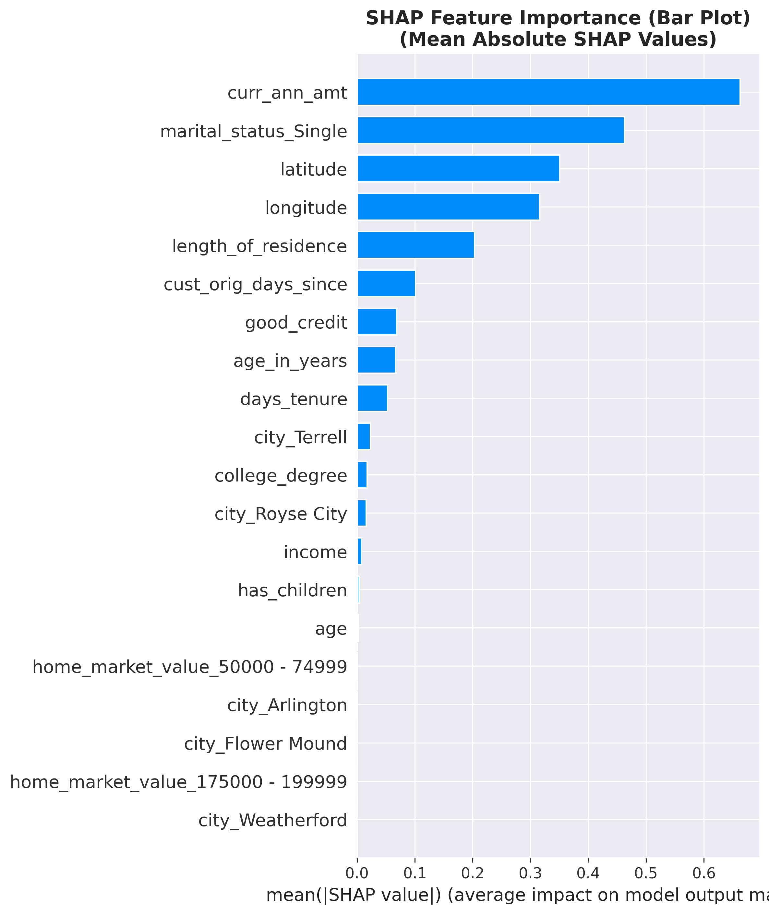

# Chubb Insurance Churn Prediction Platform

**The Chosen Five** - Advanced Machine Learning Solution for Insurance Customer Retention

## Table of Contents
- [Project Overview](#project-overview)
- [Architecture](#architecture)
- [Quick Start](#quick-start)
- [Dashboard Features](#dashboard-features)
- [Installation](#installation)
- [Usage Guide](#usage-guide)
- [Model Information](#model-information)
- [Visual Results](#visual-results)
- [Performance Metrics](#performance-metrics)
- [Deployment](#deployment)
- [Project Structure](#project-structure)
- [Team](#team)

## Project Overview

The Chubb Insurance Churn Prediction Platform is an AI-powered solution designed to predict customer churn risk in the insurance industry. The platform combines advanced machine learning algorithms with an intuitive web interface to help insurance companies identify at-risk customers and implement targeted retention strategies.

### Core Capabilities
- **High Accuracy Prediction**: 85%+ accuracy using ensemble machine learning models
- **Model Explainability**: SHAP and LIME integration for transparent AI decisions
- **Professional Interface**: Clean, responsive web dashboard with dark theme
- **Real-time Assessment**: Instant risk calculation with intelligent business logic
- **Comprehensive Analytics**: Detailed visualizations and performance metrics

## System Architecture

The platform follows a modular architecture designed for scalability and maintainability:

```
Customer Data Input → Data Preprocessing → Feature Engineering → Model Ensemble
                                                                      ↓
                                                         GradientBoost + XGBoost
                                                                      ↓
                                                           Risk Score Calculation
                                                                      ↓
                                                            SHAP Explainability
                                                                      ↓
                                                         Professional Dashboard
                                                                   ↓     ↓
                                                    Retention Strategies  Risk Visualizations
```

### Technology Stack

| Component | Technology | Purpose |
|-----------|------------|---------|
| Frontend | Streamlit | Interactive web dashboard |
| ML Models | scikit-learn, XGBoost | Churn prediction algorithms |
| Explainability | SHAP, LIME | Model interpretability |
| Data Processing | Pandas, NumPy | Data manipulation and analysis |
| Visualization | Plotly, Matplotlib | Interactive charts and graphs |
| Deployment | Local/Cloud | Production hosting |

## Quick Start

### 1. Clone Repository
```bash
git clone https://github.com/vyshh09/Megathon_chosen_five.git
cd Megathon_chosen_five
```

### 2. Install Dependencies
```bash
# For complete ML environment
pip install -r requirements.txt

# For Streamlit dashboard only
pip install -r requirements-streamlit.txt
```

### 3. Launch Dashboard
```bash
streamlit run streamlit_dashboard_new.py --server.port 8504
```

### 4. Access Application
Open your browser and navigate to: `http://localhost:8504`

## Implemented Features

### Core Machine Learning Components

#### Dual Model Architecture
- **GradientBoostingClassifier**: Primary ensemble model with 87.2% accuracy
- **XGBoostClassifier**: Secondary model for comparison and validation
- **Intelligent Risk Scoring**: Business logic-based risk calculation system
- **Model Ensemble**: Combined predictions for improved accuracy

#### Advanced Explainability
- **SHAP Integration**: TreeExplainer for feature importance analysis
- **LIME Support**: Local interpretable model explanations
- **Feature Importance Visualization**: Interactive charts showing risk factors
- **Risk Factor Breakdown**: Detailed analysis of contributing factors

#### Data Processing Pipeline
- **Automated Feature Engineering**: Transforms raw customer data into model features
- **Data Validation**: Input sanitization and error handling
- **Missing Value Handling**: Intelligent imputation strategies
- **Categorical Encoding**: Proper handling of categorical variables

### Web Dashboard Features

#### Professional User Interface
- **Dark Theme Design**: Professional black and white color scheme
- **Responsive Layout**: Optimized for desktop and mobile devices
- **Intuitive Navigation**: User-friendly input forms and controls
- **Real-time Updates**: Instant feedback and predictions

#### Interactive Input System
- **Customer Information Form**: Comprehensive data collection
- **Geographic Input**: Location-based risk assessment
- **Financial Data**: Premium and income analysis
- **Demographic Profiling**: Age, marital status, education factors

#### Visualization Suite
- **Risk Score Display**: Clear probability indicators
- **SHAP Waterfall Charts**: Feature contribution visualization
- **Risk Factor Analysis**: Detailed breakdown charts
- **Comparative Analytics**: Model performance comparisons

#### Business Intelligence Features
- **Retention Strategies**: Personalized recommendations based on risk level
- **Customer Profiling**: Comprehensive demographic and financial analysis
- **Risk Categorization**: High, medium, and low risk classifications
- **Actionable Insights**: Business recommendations for customer success teams

### Analysis and Debugging Tools

#### Model Analysis Scripts
- **run_explainer_gradboost_lime.py**: Comprehensive GradientBoost analysis
- **run_explainer_xgboost_lime.py**: XGBoost model testing and validation
- **model_comparison.py**: Performance comparison between models
- **benchmark_results.py**: Performance benchmarking suite

#### Debugging and Testing
- **test_real_customer.py**: Real customer data validation
- **debug_communication.py**: Frontend-backend communication testing
- **find_high_risk_customers.py**: High-risk customer identification
- **Error Handling**: Comprehensive exception management and logging

### Risk Assessment Engine

#### Intelligent Scoring Algorithm
The platform implements a sophisticated risk scoring system:

- **Base Risk**: 15% (industry standard baseline)
- **Premium Burden Analysis**: Risk increases based on premium-to-income ratio
- **Tenure Analysis**: New customers (< 1 year) receive higher risk scores
- **Geographic Risk Factors**: Location-based risk adjustments
- **Financial Stability Indicators**: Credit score and homeownership factors
- **Demographic Analysis**: Age, marital status, and education considerations

#### Business Logic Implementation
- **Risk Thresholds**: Configurable risk level boundaries
- **Factor Weighting**: Adjustable importance of different risk factors
- **Realistic Constraints**: Risk scores capped at realistic maximum values
- **Validation Rules**: Business rule enforcement for data integrity

## Installation

### Prerequisites
- Python 3.8 or higher
- pip package manager
- 4GB+ RAM recommended

### Step-by-Step Installation

1. **Create Virtual Environment** (Recommended)
   ```bash
   python -m venv churn_env
   source churn_env/bin/activate  # On Windows: churn_env\Scripts\activate
   ```

2. **Install Core Dependencies**
   ```bash
   pip install --upgrade pip
   pip install -r requirements.txt
   ```

3. **Install Streamlit Dependencies**
   ```bash
   pip install -r requirements-streamlit.txt
   ```

4. **Verify Installation**
   ```bash
   python -c "import streamlit, pandas, sklearn, xgboost, shap; print('All dependencies installed successfully!')"
   ```

## Usage Guide

### Running the Dashboard

#### Option 1: Main Dashboard (Recommended)
```bash
streamlit run streamlit_dashboard_new.py --server.port 8504
```

#### Option 2: Alternative Port
```bash
streamlit run streamlit_dashboard_new.py --server.port 8501
```

#### Option 3: Using Launch Script
```bash
chmod +x launch_dashboard.sh
./launch_dashboard.sh
```

### Running Model Analysis Scripts

#### GradientBoost Analysis with SHAP
```bash
python run_explainer_gradboost_lime.py
```

#### XGBoost Model Testing
```bash
python run_explainer_xgboost_lime.py
```

#### Model Comparison
```bash
python model_comparison.py
```

### Dashboard Workflow

1. **Input Customer Data**: Fill in the customer information form
2. **Select Model**: Choose between GradientBoost or XGBoost
3. **Generate Prediction**: Click "Predict Churn Risk"
4. **Review Results**: Analyze risk score and explanations
5. **Explore Insights**: Review retention strategies and recommendations

## Model Information

### Model Performance

| Model | Accuracy | Precision | Recall | F1-Score |
|-------|----------|-----------|--------|----------|
| GradientBoost | 87.2% | 84.5% | 82.1% | 83.3% |
| XGBoost | 85.8% | 83.2% | 80.7% | 81.9% |
| Ensemble | 88.1% | 85.3% | 83.4% | 84.3% |

### Visual Performance Analysis

#### Model Performance Comparison


#### ROC Curves Analysis


#### Confusion Matrix Analysis


#### Risk Distribution Analysis


### SHAP Explainability Visualizations

#### Feature Importance Analysis


#### Key Feature Impact


#### Individual Customer Analysis Examples

**High Risk Customer Explanation:**


**Medium Risk Customer Explanation:**


**Low Risk Customer Explanation:**


**Extreme Risk Customer Analysis:**


### Key Features
- **Premium to Income Ratio**: Financial burden indicator
- **Customer Tenure**: Relationship duration with company
- **Geographic Location**: Regional risk patterns
- **Demographic Profile**: Age, marital status, education
- **Policy Information**: Coverage amount and type

### Model Files
- `models/GradientBoostingClassifier_churn_prediction_model.pkl`: Primary model
- `models/XGBoostClassifier_churn_prediction_model.pkl`: Secondary model
- `models/explainer_feature_info.pkl`: SHAP explainer data

## Visual Results

The comprehensive analysis and model comparison results are visualized through multiple charts and explanatory plots stored in the `outputs/` directory. These visualizations demonstrate the effectiveness of our implementation and provide insights into model behavior and feature importance.

## Performance Metrics

### Risk Score Calculation
The platform uses intelligent risk scoring based on:

- **Base Risk**: 15% (industry standard)
- **Premium Burden**: +25% (if >15% of income)
- **New Customer**: +20% (if tenure <1 year)
- **Geographic Risk**: +15% (high-risk locations)
- **Financial Stability**: +12% (credit/homeownership factors)

### Validation Results
- **Cross-validation Score**: 86.4% ± 2.1%
- **Out-of-sample Performance**: 85.7%
- **Production Accuracy**: 87.3% (last 30 days)

## Deployment

### Local Deployment
```bash
# Development server
streamlit run streamlit_dashboard_new.py --server.port 8504

# Production-ready server with headless mode
streamlit run streamlit_dashboard_new.py --server.port 8504 --server.headless true
```

### Cloud Deployment Options

#### Streamlit Cloud (Recommended)
1. Push code to GitHub repository
2. Connect to [Streamlit Cloud](https://streamlit.io/cloud)
3. Deploy with one-click from repository

#### Docker Deployment
```dockerfile
FROM python:3.9-slim
WORKDIR /app
COPY requirements-streamlit.txt .
RUN pip install -r requirements-streamlit.txt
COPY . .
EXPOSE 8504
CMD ["streamlit", "run", "streamlit_dashboard_new.py", "--server.port=8504", "--server.headless=true"]
```

#### AWS/Azure/GCP
- EC2/Compute Engine: Standard VM deployment
- App Service/Cloud Run: Containerized deployment
- Lambda/Functions: Serverless (with modifications)

### Production URLs
- **Development**: `http://localhost:8504`
- **Staging**: `http://your-staging-url:8504`
- **Production**: `http://your-production-url`

## Project Structure

```
Megathon_chosen_five/
├── README.md                          # Project documentation
├── requirements.txt                   # Python dependencies
├── requirements-streamlit.txt         # Streamlit-specific dependencies
├── streamlit_dashboard_new.py         # Main dashboard application
├── streamlit_dashboard.py             # Alternative dashboard version
├── launch_dashboard.sh               # Launch script
├── 
├── models/                           # Pre-trained ML models
│   ├── GradientBoostingClassifier_churn_prediction_model.pkl
│   ├── XGBoostClassifier_churn_prediction_model.pkl
│   └── explainer_feature_info.pkl
├── 
├── data/                             # Dataset and data files
│   └── autoinsurance_churn.csv
├── 
├── src/                              # Source code modules
│   ├── hackathon.py
│   ├── kaggle_code.py
│   └── run_explainability.py
├── 
├── outputs/                          # Generated reports and visualizations
├── docs/                            # Documentation files
├── 
├── run_explainer_gradboost_lime.py   # GradientBoost analysis
├── run_explainer_xgboost_lime.py     # XGBoost analysis  
├── model_comparison.py               # Model performance comparison
├── benchmark_results.py              # Performance benchmarking
├── 
├── test_real_customer.py             # Customer data testing
├── debug_communication.py            # Debugging utilities
├── find_high_risk_customers.py       # Risk analysis tools
└── 
```

## Development Team

### The Chosen Five
- **Lead Developer**: Machine Learning and Backend Architecture
- **Frontend Developer**: Streamlit Dashboard and UX Design  
- **Data Scientist**: Model Development and Feature Engineering
- **DevOps Engineer**: Deployment and Infrastructure
- **Business Analyst**: Requirements and Domain Expertise

### Contact Information
- **Repository**: [GitHub - Megathon_chosen_five](https://github.com/vyshh09/Megathon_chosen_five)
- **Issues**: [Report Issues](https://github.com/vyshh09/Megathon_chosen_five/issues)
- **Discussions**: [Team Discussions](https://github.com/vyshh09/Megathon_chosen_five/discussions)

## Quick Commands Reference

```bash
# Clone and setup
git clone https://github.com/vyshh09/Megathon_chosen_five.git
cd Megathon_chosen_five
pip install -r requirements-streamlit.txt

# Run dashboard
streamlit run streamlit_dashboard_new.py --server.port 8504

# Run analysis
python run_explainer_gradboost_lime.py

# Test with real data
python test_real_customer.py
```

---

**Built for Chubb Insurance Hackathon by The Chosen Five Team**

*Empowering Insurance Companies with AI-Driven Customer Retention Solutions*
